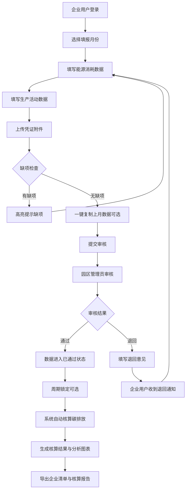

## 1. 产品概述

企业碳排放核算 Web 应用，服务于产业园区内多家企业的温室气体排放数据提交、审核与分析管理。系统支持企业按月填报能源消耗与生产活动数据，园区管理员进行数据审核与周期锁定，并自动核算范围一（直接排放）和范围二（间接排放）碳排放，提供多维度对比分析与报告导出功能。

- 目标用户：园区内企业填报人员、园区管理员/审核员
- 核心价值：规范化碳数据管理流程，自动化碳排放核算，助力园区碳达峰碳中和目标管控

## 2. 核心功能

### 2.1 用户角色

| 角色 | 登录方式 | 核心权限 |
|------|----------|----------|
| 企业用户 | 账号登录 | 数据填报、凭证上传、查看核算结果、历史数据复制 |
| 园区管理员 | 账号登录 | 企业名录管理、审核任务处理（退回/通过/批量审核）、周期锁定、导出报告、全局数据分析 |

### 2.2 功能模块

1. **企业名录**：企业基础信息列表、新增/编辑/停用企业、行业分类、搜索筛选
2. **数据填报**：按月填报用电、燃气、蒸汽、车辆燃油、生产活动数据，缺项提示，历史数据复制
3. **凭证附件**：账单/凭证文件上传、列表管理、预览下载
4. **审核任务**：待审核列表、审核详情、退回修正、批量通过、周期锁定状态
5. **核算结果**：范围一/范围二排放汇总、分项排放明细、企业维度查询
6. **对比分析**：行业均值对比、环比趋势图表、异常波动提醒、多企业对比

### 2.3 页面详情

| 页面名称 | 模块名称 | 功能描述 |
|----------|----------|----------|
| 企业名录 | 搜索筛选区 | 按企业名称、行业、状态搜索筛选 |
| 企业名录 | 企业列表 | 展示企业基本信息、行业、联系人、状态、操作按钮 |
| 企业名录 | 企业表单 | 新增/编辑企业信息（名称、统一社会信用代码、行业、规模、联系人、地址等） |
| 数据填报 | 周期选择 | 选择填报月份、切换企业 |
| 数据填报 | 能源消耗表单 | 用电量、燃气量、蒸汽量、车辆燃油量分项录入，带单位说明 |
| 数据填报 | 生产活动表单 | 主要产品产量、工艺活动数据录入 |
| 数据填报 | 缺项提示 | 实时检测必填项缺失，高亮提示 |
| 数据填报 | 历史复制 | 一键复制上月或任意历史月份数据 |
| 凭证附件 | 文件上传区 | 拖拽上传、多文件上传、格式限制（PDF/图片/Excel） |
| 凭证附件 | 附件列表 | 展示文件名、上传时间、关联月份、操作（预览/下载/删除） |
| 审核任务 | 任务统计卡片 | 待审核、已通过、已退回、已锁定数量统计 |
| 审核任务 | 审核列表 | 企业、月份、提交时间、状态、操作列 |
| 审核任务 | 审核弹窗 | 数据详情查看、审核意见填写、通过/退回操作 |
| 审核任务 | 批量操作 | 多选批量审核通过、批量锁定周期 |
| 核算结果 | 排放概览 | 范围一、范围二、总排放量数值展示及同比环比 |
| 核算结果 | 排放构成饼图 | 各排放源占比可视化 |
| 核算结果 | 企业维度查询 | 筛选企业、时间范围查看核算明细 |
| 对比分析 | 行业均值对比 | 柱状图展示企业排放与行业基准对比 |
| 对比分析 | 环比趋势 | 折线图展示近12个月排放趋势 |
| 对比分析 | 异常波动提醒 | 自动识别环比变动超过阈值的记录并标红预警 |
| 对比分析 | 多企业对比 | 选择多家企业进行横向柱状图对比 |

## 3. 核心流程

企业用户按月完成数据填报并上传凭证后提交，系统自动计算碳排放；园区管理员对提交数据进行审核，可通过或退回修正；审核通过后可锁定周期，数据不可再修改；系统提供多维度分析和导出功能。

## 4. 用户界面设计

### 4.1 设计风格
- **主色调**：深森林绿 `#0F5132`（象征环保与可持续），辅助色为活力橙 `#F97316`（数据警示）和湖蓝 `#0EA5E9`（中性信息）
- **基础色**：中性灰 Zinc 系列作为底色和文字层级
- **按钮风格**：圆角 8px，主按钮实色填充，次要按钮描边+悬浮填充过渡
- **字体**：标题使用思源黑体（Noto Sans SC）Bold，正文使用思源黑体 Regular，数字等宽字体提升数据可读性
- **布局风格**：左侧固定导航栏 + 顶部面包屑 + 主内容卡片式布局，数据密集区域采用表格+图表组合
- **图标风格**：Lucide 线性图标，统一 20px 尺寸，保持视觉简洁

### 4.2 页面设计概览

| 页面名称 | 模块名称 | UI 元素 |
|----------|----------|---------|
| 企业名录 | 筛选+列表 | 顶部筛选条、搜索框、新增按钮，表格展示企业列表，行悬浮高亮，斑马纹提升可读性 |
| 数据填报 | 表单+缺项提示 | 分区块表单卡片，每项数据带单位标签，缺项字段红框+感叹号图标提示，右侧浮动缺项清单面板 |
| 审核任务 | 统计卡片+表格 | 顶部 4 个状态统计卡片（待审核/已通过/已退回/已锁定），数据表格带状态徽章，批量操作栏 |
| 核算结果 | 数值卡片+图表 | 3 个大号数值卡片（范围一/范围二/总量）带趋势箭头，下方饼图+明细表组合布局 |
| 对比分析 | 多图表布局 | 2x2 网格布局：行业均值柱状图、环比趋势折线图、异常预警列表、多企业对比选择器 |

### 4.3 响应式设计
- 桌面端优先（1440px 基准），适配 1280px 及以上分辨率
- 导航栏在屏幕宽度 < 1024px 时可折叠为汉堡菜单
- 数据表格支持横向滚动，图表自适应容器宽度
- 移动端重点保障数据录入和审核操作可用

### 4.4 动画与微交互
- 页面加载时卡片依次淡入（staggered fade-in）
- 按钮 hover 状态 150ms 过渡，轻微上移 + 阴影增强
- 数据提交成功/审核操作结果使用 Toast 消息提示（3秒自动消失）
- 图表数据变化时使用平滑过渡动画
- 缺项提示从右侧滑入面板，带轻微阴影
