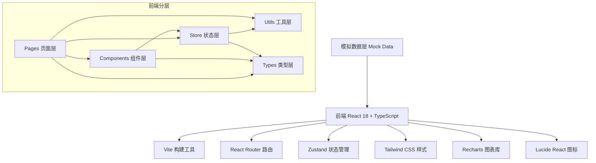
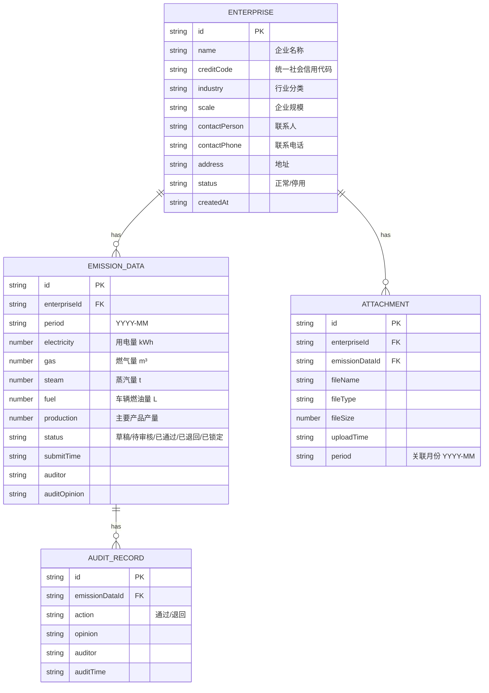

## 1. 架构设计



## 2. 技术选型说明

- **前端框架**：React 18 + TypeScript — 组件化开发，类型安全，生态成熟
- **构建工具**：Vite — 开发速度快，HMR 热更新体验优秀
- **路由管理**：react-router-dom v6 — 声明式路由，支持嵌套路由
- **状态管理**：zustand — 轻量、简洁、无 boilerplate，适合中小型应用
- **样式方案**：Tailwind CSS v3 — 原子化 CSS，开发效率高，设计系统一致性好
- **图表可视化**：recharts — React 原生图表库，支持柱状图、折线图、饼图等
- **图标库**：lucide-react — 轻量、美观的线性图标库
- **后端**：无后端，使用本地 Mock 数据 + localStorage 持久化模拟
- **数据库**：localStorage 作为浏览器端数据存储

## 3. 路由定义

| 路由路径 | 页面名称 | 说明 |
|----------|----------|------|
| `/` | 数据概览 Dashboard | 应用首页，展示关键指标与快捷入口 |
| `/enterprises` | 企业名录 | 企业信息列表、新增、编辑、停用 |
| `/data-entry` | 数据填报 | 按月填报能源消耗与生产活动数据 |
| `/attachments` | 凭证附件 | 文件上传、预览、下载、删除 |
| `/audit` | 审核任务 | 审核列表、审核详情、批量操作、周期锁定 |
| `/results` | 核算结果 | 范围一/范围二排放汇总、排放构成 |
| `/analysis` | 对比分析 | 行业对比、环比趋势、异常预警、多企业对比 |

## 4. 数据模型定义

### 4.1 核心数据实体



### 4.2 碳排放核算公式

- **范围一（直接排放）** = 燃气量 × 燃气排放因子 + 燃油量 × 燃油排放因子
- **范围二（间接排放）** = 用电量 × 电网排放因子 + 蒸汽量 × 蒸汽排放因子
- **总排放** = 范围一 + 范围二

排放因子参考值（tCO₂/单位）：
- 电力：0.5810 tCO₂/MWh = 0.000581 tCO₂/kWh
- 天然气：2.1622 kgCO₂/m³ = 0.0021622 tCO₂/m³
- 蒸汽：0.11 tCO₂/t
- 汽油：2.9251 kgCO₂/L = 0.0029251 tCO₂/L

## 5. 项目目录结构

```
src/
├── components/          # 公共组件
│   ├── Layout/          # 布局组件（侧边栏、头部导航）
│   ├── DataTable/       # 通用数据表格
│   ├── StatusBadge/     # 状态徽章
│   ├── StatCard/        # 统计卡片
│   ├── Modal/           # 通用弹窗
│   ├── EmptyState/      # 空状态
│   └── Toast/           # 消息提示
├── pages/               # 页面组件
│   ├── Dashboard/       # 数据概览
│   ├── Enterprises/     # 企业名录
│   ├── DataEntry/       # 数据填报
│   ├── Attachments/     # 凭证附件
│   ├── Audit/           # 审核任务
│   ├── Results/         # 核算结果
│   └── Analysis/        # 对比分析
├── store/               # Zustand 状态管理
│   ├── enterprise.ts    # 企业状态
│   ├── emission.ts      # 排放数据状态
│   ├── audit.ts         # 审核状态
│   └── ui.ts            # UI 全局状态
├── types/               # TypeScript 类型定义
│   ├── index.ts
│   └── emission.ts
├── utils/               # 工具函数
│   ├── calculator.ts    # 碳排放核算
│   ├── formatter.ts     # 数据格式化
│   ├── export.ts        # 导出工具
│   └── mockData.ts      # Mock 数据生成
├── App.tsx              # 根组件
├── main.tsx             # 入口文件
└── index.css            # 全局样式
```

## 6. 前端组件划分策略

| 页面 | 子组件 | 职责 |
|------|--------|------|
| 企业名录 | EnterpriseFilter | 搜索筛选表单 |
| 企业名录 | EnterpriseTable | 企业列表表格 |
| 企业名录 | EnterpriseFormModal | 新增/编辑企业弹窗 |
| 数据填报 | PeriodSelector | 月份与企业选择器 |
| 数据填报 | EnergyForm | 能源消耗表单 |
| 数据填报 | ProductionForm | 生产活动表单 |
| 数据填报 | MissingPanel | 缺项提示侧面板 |
| 数据填报 | CopyHistoryBtn | 历史数据复制按钮 |
| 审核任务 | AuditStats | 顶部统计卡片组 |
| 审核任务 | AuditTable | 审核任务列表 |
| 审核任务 | AuditModal | 审核操作弹窗 |
| 审核任务 | BatchActionBar | 批量操作工具栏 |
| 核算结果 | EmissionOverview | 排放概览数值卡片 |
| 核算结果 | EmissionPieChart | 排放构成饼图 |
| 核算结果 | EmissionDetailTable | 排放明细表 |
| 对比分析 | IndustryCompare | 行业均值对比柱状图 |
| 对比分析 | TrendChart | 环比趋势折线图 |
| 对比分析 | AlertList | 异常波动提醒列表 |
| 对比分析 | MultiCompare | 多企业对比选择器与图表 |
